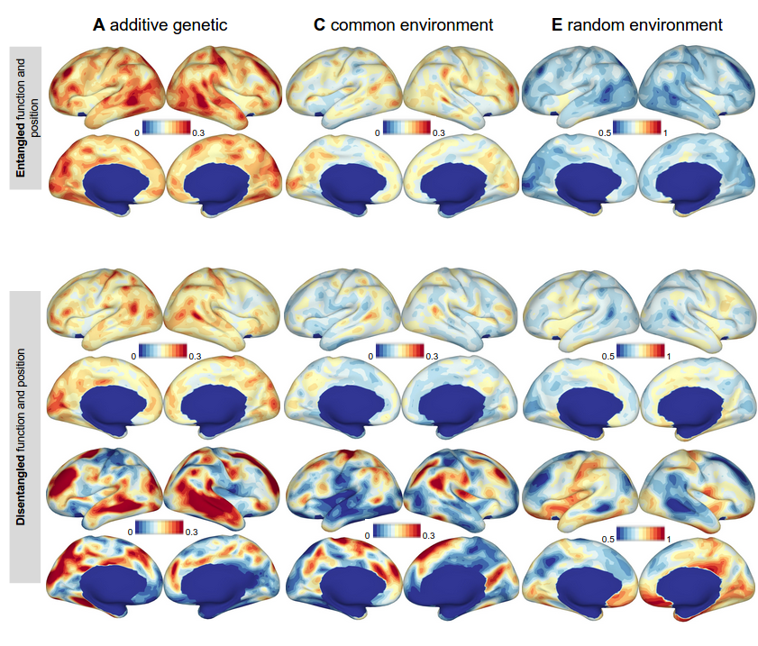

# Project Description

This directory contains code to create cortical brainmaps showing genetic 
and environmental cotribution to functional inter-subject variability. 
The corresponding paper "Disentangling cortical functional connectivity 
strength and topography reveals divergent roles of genes and environment" 
is available [here](https://doi.org/10.1016/j.neuroimage.2021.118770) ([biorXiv](https://www.biorxiv.org/content/10.1101/2021.04.08.438586v1)).

## Data
We used data from the 1200 subjects release of the Human Connectome Project. In
particular we used the ICA-FIX denoised dataset, which includes only 
grayordinates and already went through initial preprocessing. More information
on the release can be found [here](https://www.humanconnectome.org/study/hcp-young-adult/document/1200-subjects-data-release). 
To access some of the subject-related information (f.e. zygosity) Restricted 
Access Data Use Terms have to be accepted (See [Quick Reference: Open Access vs Restricted Data](https://www.humanconnectome.org/study/hcp-young-adult/document/quick-reference-open-access-vs-restricted-data)).
Data can be downloaded from [ConnectomeDB](https://db.humanconnectome.org/app/template/Login.vm) 
after creating a user account.

## Assumptions
- It is assumed that the downloaded data is already mapped to freesurfer's 
fsavarage4 surface in mgh-format and stored in two folders corresponding to 
data download:
   - HCProot/HCP_3T_RESTA_fmri
   - HCProot/HCP_3T_RESTB_fmri.
  
  We also applied bandpass filtering and global signal regression, which is also
indicated in the file name (f.e. lh.rfMRI_REST1_LR_Atlas_hp2000_clean_bpss_gsr_fs4.mgh).

- Additionally, the relative mean motion for each subject is stored in txt-files
in similar folders
   - HCProot/HCP_3T_RESTA_Motion/motion_mean/
   - HCProot/HCP_3T_RESTA_Motion/motion_mean/

  named for example REST1_LR_Movement_RelativeRMS_mean.txt

- inflated surface and sphere (VTK-format !) surface of fsaverage4 have to be copied
in Deliveries/fsaverage4-folder.
  
To map from HCP-space to fsaverage4 you can follow this [manual](https://wiki.humanconnectome.org/display/PublicData/HCP+Users+FAQ#HCPUsersFAQ-9.HowdoImapdatabetweenFreeSurferandHCP?). 
It requires [Connectome Workbench](https://humanconnectome.org/software/connectome-workbench) and [Freesurfer](https://surfer.nmr.mgh.harvard.edu/fswiki/DownloadAndInstall), which can be installed
for free. The freesurfer command mris_convert is useful to convert between 
image file formats.

You will also need to install the R-package [OpenMX](https://openmx.ssri.psu.edu/). An MSM binary is also required in Code/Embedding. 
We provide the one for centos, if you require a different binary, 
you can find them [here](https://www.doc.ic.ac.uk/~ecr05/MSM_HOCR_v2/).

## Pipeline
Here is the order in which the scripts in the Code-folder need to be run:
- settigs.py and settings.Renviron: _set paths of projectfolder and data_
  

- LargeCorrelation_ParcelSelection/calcCors.py, referenceCors.py and select_parcels.py:
  _calculate fMRI correlation matrices, chose representative parcels of Yeo networks_

- PrepareTables/SelectedROICorrs_vertex.py:_calculate tables for twin model input (entagled fucntional connectivity and disentagled connectivity strength)_

- Embedding/
  - cosine.py
  - MSM_alignment.py
  - MSMcorrespondance_vertex.py
  

- PrepareTables/
  - SelectedROICorrs_vertex.py: _change input and output directory_ 
    for disentagled connectivity strength
  - SelectedROICorrs_position.py: _create tables for twin model input (topography/spatial layout)_  
  
- Remove_GenderMotion/
  - getSubjectID.py
  - getMeanMotion.py
  - getGender.R
  - RemoveGender_Motion.R (set directories according to entagled or disentagled setting) and RemoveGender_Motion_position.R

- Models/
  - estimate_factors.R (set directories according to entagled or disentagled setting) and estimate_factors_position.R: _twin models vor each vertex_
  - create_matrices_vertex.py: _create brain surface maps based on estimates obtained by twin model_
  
## Deliveries
In the deliveries folder we provide files, which are needed by the scripts.
Most of those file will be regenerated, when running the scripts.
Exceptions are
- the parcellation files Schaefer2018_Parcels_7Networks_oder.annot 
  for left and right hemisphere: _The parcellation for fsaverage5 was
  taken from [here](https://github.com/ThomasYeoLab/CBIG/tree/master/stable_projects/brain_parcellation/Schaefer2018_LocalGlobal/Parcellations/FreeSurfer5.3) and mapped through freesurfer's mri_surf2surf command to fsaverage4_
- Subjects.csv: _It contains the ID of subjects used in our paper. When running the scripts, it will be regenerated containing additional subject-related information_

## Output
- 7NETS_vertex:_contains subfolders with script outputs_
- long_corr_matricesLR and long_corr_matricesRL: _subject_vise vertex-by-vertex correlation matrices for LR and RL runs_

## Maps for genetic (A), common environmental (C) and random environmental (E) contribution

The Deliveries-folder also contains *.mat- files with ACE-brain maps compatible with Freesurfer's fsaverage4 for entangled and disentangled function and position, which can also be seen in the image above (and also in Figure 2 and Supplementary Figure 6 of our paper).
The files are:
- ACE_matrices_anat.mat: entangled function and position
- ACE_matrices_func.mat: disentangled function
- ACE_matrices_pos.mat: disentangled position

Note: Negative values have been assigned to the medial wall, since no fMRI signal was available for this area. They are basically meaningless.
